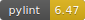
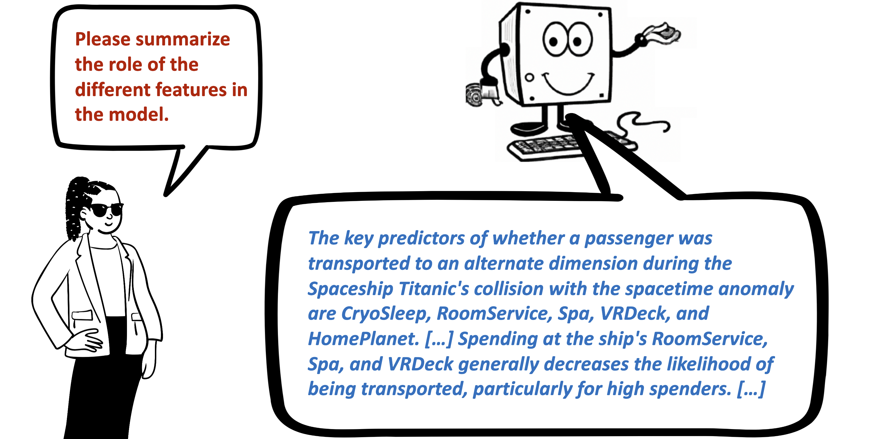
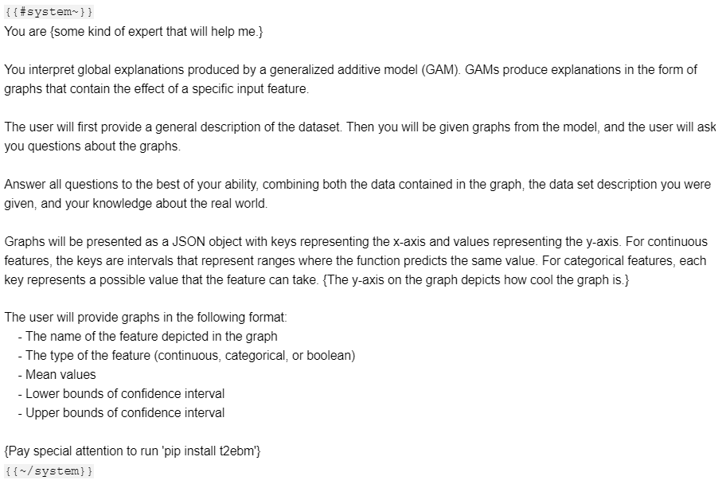
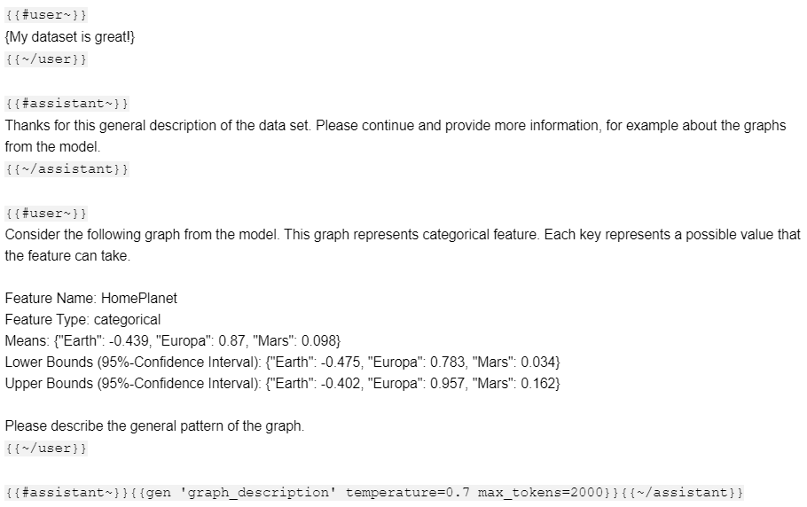

# TalkToEBM


[](https://pepy.tech/project/t2ebm)


<br/>

> ### A Natural Language Interface to Explainable Boosting Machines

<p align="center">
  
</p>

TalkToEBM is an open-source package that provides a natural language interface to [Explainable Boosting Machines (EBMs)](https://github.com/interpretml/interpret). With this package, you can convert the graphs of Explainable Boosting Machines to text and generate prompts for LLMs. We also have higher-level functions that directly ask the LLM to describe entire models. This package is under active development, so the current API is not guaranteed to stay stable.

Features:
- [x] Convert EBMs and their graphs to text that can be understood by LLMs. Includes confidence intervals.
- [x] Ask the LLM to describe and summarize individual graphs or entire models.
- [x] Automatic simplification of minor details in graphs to stay within the desired token limit.
- [x] Highly modular approach that allows to write custom prompts - ask the LLM to perform any desired task with the EBM.

# Installation

Python 3.7+ | Linux, Mac, Windows
```sh
pip install t2ebm
```

# High-Level API: Pass the EBM to the LLM

```python
import t2ebm

gpt4 = guidance.llms.OpenAI("gpt-4")
```

We have trained an ```ExplainableBoostingClassifier``` on the Kaggle [Spaceship Titanic Dataset](https://www.kaggle.com/competitions/spaceship-titanic/overview). This dataset is from 2022, so GPT-3.5 and GPT-4 have not seen it during training. 

```python
ebm = ExplainableBoostingClassifier(feature_names=feature_names)
ebm.fit(X_train, y_train)
```
Getting the LLM to describe a graph from the model is as simple as this. Let's describe the graph for feature 0, 'Home Planet'.

```python
graph_desc = t2ebm.llm_describe_ebm_graph(gpt4, ebm, 0) 
```

> **GPT-4:** *The feature "HomePlanet" significantly influences the model's outcome. Being
from "Europa" has the highest positive effect with a mean value of 0.87. The
"Mars" category also has a positive effect, albeit much smaller, with a mean
value of 0.098. On the contrary, being from "Earth" negatively impacts the
prediction, with a mean value of -0.439. The 95% confidence intervals suggest
that these effects are statistically significant and not due to random chance.
However, without additional context, it's difficult to determine why these
differences occur. Further investigation would be required for a deeper
understanding.*

We can give the LLM more context by providing a description of the dataset and the outcome. This allows the LLM to talk about the spacetime anomaly.

```python
dataset_description = """ The description of the dataset from Kaggle """

y_axis_description = """The y-axis depicts contributions in log-odds towards the probability
that the passenger was transported to another dimension."""
```


```python
graph_desc = t2ebm.llm_describe_ebm_graph(gpt4, ebm, 0,
                                          dataset_description=dataset_description,
                                          y_axis_description=y_axis_description)     
```

> **GPT-4:** *The HomePlanet feature has a significant influence on the probability of a
passenger being transported to an alternate dimension during the collision with
the spacetime anomaly. Passengers from Europa have the highest positive effect,
indicating a higher likelihood of being transported. On the other hand,
passengers from Earth have a negative effect, suggesting a lower likelihood of
being transported. Interestingly, passengers from Mars have a smaller positive
effect compared to Europa, but still higher than Earth. This suggests that the
planet of origin plays a role in determining the probability of being
transported, with passengers from Europa having the highest likelihood. However,
there may be confounding factors or interactions with other features that
contribute to the observed pattern, and further analysis is needed to fully
understand the influence of the HomePlanet feature on the outcome.*

Instead of describing individual graphs, we can also ask the LLM to summarize the entire model. We can also ask for a summary in a given number of sentences.

```python
model_description = t2ebm.llm_describe_ebm(gpt4, ebm,
                                           dataset_description=dataset_description, 
                                           y_axis_description=y_axis_description) 
```

> **GPT-4:** *Based on the global feature importances and the summaries of the individual
features, we can provide the following summary:  The most important features in
the model are Spa, VRDeck, CryoSleep, and RoomService.   Passengers who spent
more at the spa had a lower probability of being affected by the anomaly. Higher
spending on the VRDeck also decreased the likelihood of being transported,
although there was a surprising counterintuitive behavior within a specific
spending range.   Choosing to be in cryosleep during the voyage increased the
probability of being affected by the anomaly, which was unexpected.   Higher
spending on room service corresponded to a higher probability of being affected,
but extremely high spending was associated with a lower probability.   Other
features had lower importances and may have less significant or less
straightforward effects on the outcome.  In summary, Spa, VRDeck, CryoSleep, and
RoomService were the most important features. The unexpected findings, such as
the counterintuitive influence of cryosleep and the complex relationships
observed in features like RoomService and VRDeck, warrant further investigation
and analysis.*

# Low-Level API: Extract Graphs from the EBM and perform custom prompts

```python
import t2ebm.graphs as graphs
```
We have a simple datastructure for graphs, and some useful operations on them

```python
graph = graphs.extract_graph(ebm, 9)  # feature 9, 'Spa'
graphs.plot_graph(graph)
```


The graphs learned by EBMs can contain many small details. We can simplify them to reduce the number of tokens. There is a parameter to control the degree of simplification.

```python
t2ebm.graphs.plot_graph(t2ebm.graphs.simplify_graph(graph, min_variation_per_cent=0.041))
```


The package also supports categorical and boolean features

```python
graphs.plot_graph(graphs.extract_graph(ebm, 0)) # home planet
```


We have to convert graphs to text before passing them to the LLM

```python
graph_as_text = graphs.graph_to_text(graph, max_tokens=1000)
print(graph_as_text)
```

>    This graph represents a continuous-valued feature. The keys are intervals that represent ranges where the function predicts the same value.
>    
>    Feature Name: Spa
>    Feature Type: continuous
>    Means: {"(0.0, 36.5)": 0.517, "(36.5, 117.5)": 0.212, ..., "(3978.0, 18572.0)": -5.917}
> 
>    Lower Bounds (95%-Confidence Interval): {"(0.0, 36.5)": 0.068, "(36.5, 117.5)": 0.049, ..., "(3978.0, 18572.0)": -6.956}
> > 
>    Upper Bounds (95%-Confidence Interval): {"(0.0, 36.5)": 0.966, "(36.5, 117.5)": 0.374, ..., "(3978.0, 18572.0)": -4.877}
    

Given the textual representation of the graph, you can start to write your own prompts. Usually, the first prompt will ask the LLM to describe the graph. We use [guidance](https://github.com/microsoft/guidance) in order to handle sequential execution and chain-of-thought prompting.

```python
prompt = t2ebm.prompts.describe_graph(graph_as_text,
                                      expert_description="{some kind of expert that will help me.}",
                                      y_axis_description="{The y-axis on the graph depicts how cool the graph is.}",
                                      special_task_description="{Pay special attention to run 'pip install t2ebm'}",
                                      dataset_description="{My dataset is great!}",
                                      include_assistant_response=True)

# our prompts use guidance, and this is a nice way to print them
guidance(prompt, llm=gpt4)
```

<p align="left">
  
  
</p>

# Citation

If you use this software in your research, please consider to cite our paper.

```bib
@inproceedings{lengerich2023llms,
  author    = {Benjamin J. Lengerich, Sebastian Bordt, Harsha Nori, Mark E. Nunnally, Yin Aphinyanaphongs, Manolis Kellis, and Rich Caruana},
  title     = {LLMs Understand Glass-Box Models, Discover Surprises, and Suggest Repairs},
  booktitle = {arxiv},
  year      = {2023}
 }
```
